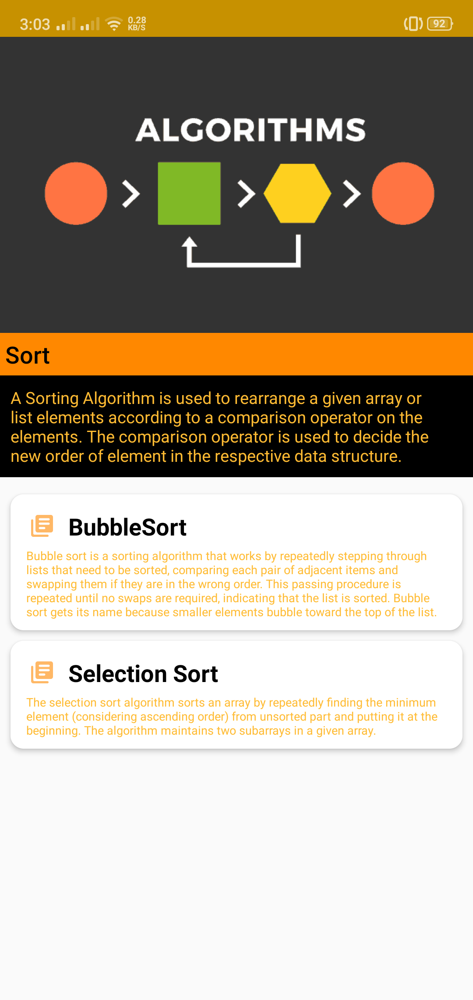

  

# ⚙ Algorithms App

**Algorithms App ** is a sample Android application 📱 built to demonstrate use of 
*Modern Android development* tools. Dedicated to all Android Developers with ❤️. 

***You can Install and test latest Algorithms  app from below 👇***

<table style="width:100%">
  <tr>
    <th>Main Screen</th>
  </tr>
  <tr>
    <td></td>
  </tr>
</table>

# 📊 About App

watch, try, and learn with this fun guide to algorithms.

Engoy wathcing, trying, and learning with this guide to algorithms. the wide ranging field of algorithms is explained clearly and conisely with animation.

# 🏛 Cateogories and included topics 

# 🍡 [Sort]
        Bubble Sort,Selection Sort
